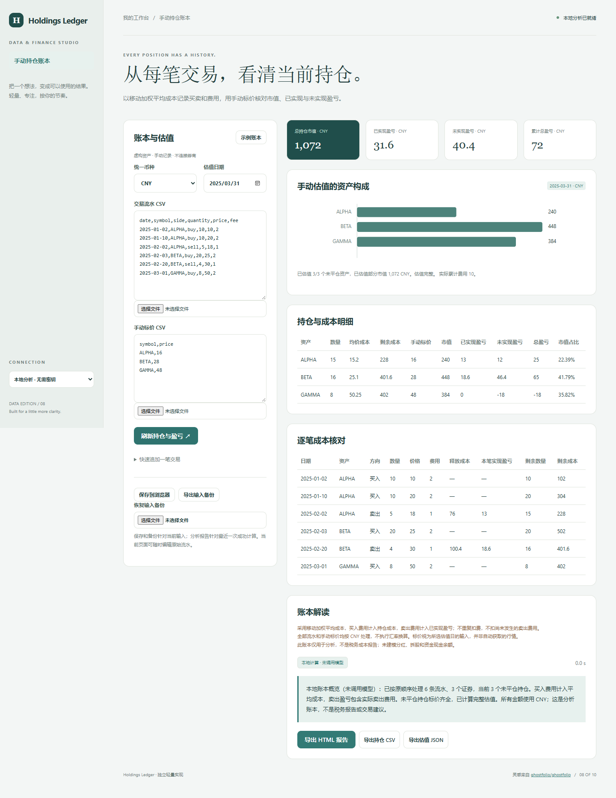

# Holdings Ledger

以移动加权平均成本记录买卖和费用，用手动标价核对市值、已实现与未实现盈亏。

- 整股买卖记录与移动加权平均成本
- 手动标价、缺失估值与资产占比
- 交易逐行核对和单一币种汇总
- 浏览器保存、JSON备份恢复、HTML / CSV 报告



## 快速开始

需要 Node.js 24 或更新版本；无第三方运行依赖，无需 npm install。

```sh
git clone https://github.com/Yiwen-Yang-BA/chatgpt-holdings-ledger.git
cd chatgpt-holdings-ledger
npm start
```

打开 http://127.0.0.1:3208 。默认进入**本地分析模式**，不调用 API；统计值由本地代码计算。示例数据为人工构造，界面明确标注。

### 接入真实模型

复制 `.env.example` 为 `.env`，填写 `OPENAI_API_KEY`，按账号权限设置 `OPENAI_MODEL`，然后重启服务并切换界面中的「AI 解读」。`OPENAI_BASE_URL` 必须支持 OpenAI Responses API；仅兼容 Chat Completions 的服务不适用。密钥只在服务端读取，不写入前端或仓库。

```sh
# Docker（可选；必须显式传入配置）
docker build -t chatgpt-holdings-ledger .
docker run --rm -p 127.0.0.1:3208:3208 --env-file .env chatgpt-holdings-ledger
```

## 使用方法

1. 交易 CSV 使用 date,symbol,side,quantity,price,fee；side 为 buy/sell，按日期非降序排列。
2. 标价 CSV 使用 symbol,price，可暂缺标价；数量为正整数，标识使用字母数字及 . \_ -。
3. 选择统一记账币种与估值日期，刷新持仓；标价为估值日期的手动输入。
4. 可快速追加记录、保存当前输入到浏览器，或导出 JSON 备份恢复。

## 计算口径

只支持单一币种与整股，不计算现金余额、外汇、分红或税务申报。买入成本=数量×价格+实际费用；移动平均成本=剩余成本/数量。卖出释放数量×卖前平均成本，已实现盈亏=卖出收入−卖出费−释放成本；全部卖完清零数量与成本。市值=数量×手动标价，未实现盈亏=市值−剩余成本；不计未发生的退出费。缺少任意未平仓标价时，总市值、未实现及总盈亏显示未定义，单独显示已估值部分；真实零标价保留为零。只有完整估值且总市值>0才计算资产占比。日期须真实且不晚于估值日；同日按输入顺序执行；不允许卖空或超卖。最多100个资产，单资产持仓不超过1e9股，价格和费用不超过1e9，金额计算范围为绝对值1e12。平均成本仅供分析，不等同税务成本法。参考 [IBKR 盈亏与费用口径](https://www.ibkrguides.com/traderworkstation/profit-and-loss.htm)。

## 验证

```sh
npm run check
npm test
```

测试覆盖业务规则以及本地 HTTP 服务、模拟模型接口、输入校验和错误处理。真实付费模型调用需要用户配置有效密钥，未将本地分析测试作为真实模型质量验证。GitHub Actions 在每次推送时运行检查。

## 参考与复刻范围

灵感来自 [ghostfolio/ghostfolio](https://github.com/ghostfolio/ghostfolio)（AGPL-3.0）。查询快照：2026-10-04；9,395 stars；最近推送 2026-10-03。这是当前星标量与更新状态，**不是近一个月新增星标排名**。

本仓库是对其核心交互和用途的独立轻量实现，未复制上游源码、商标或静态资源，不声称实现上游的全部功能，也不属于上游官方产品。

独立复刻手动交易台账与持仓追踪，记录买入、卖出、费用和手动估值，计算数量、成本、已实现与未实现盈亏及资产占比。采用单一记账币种并明确成本法，不接入券商、不自动下单、不获取实时价格、不计算税务申报结果。

## 模型接收的数据

模型只接收币种/估值日期、当前持仓和汇总盈亏，不发送原始逐笔买卖记录。

## 数据与部署边界

仅在点击保存后将交易与标价存到当前浏览器本地存储；可导出独立备份。没有银行或券商同步。 本地分析数据不离开本机；AI 解读仅发送本项目 README 说明的统计摘要到所配置的模型服务。

默认只监听 127.0.0.1，适用于单人本地使用；没有多用户登录或持久数据库。如需公网部署，请先增加身份验证、配额和 HTTPS。服务限制请求大小、并发和超时，禁止从静态目录读取密钥文件。

接口实现依据 [OpenAI 官方文本生成文档](https://developers.openai.com/api/docs/guides/text)。

## License

MIT — independent implementation.
